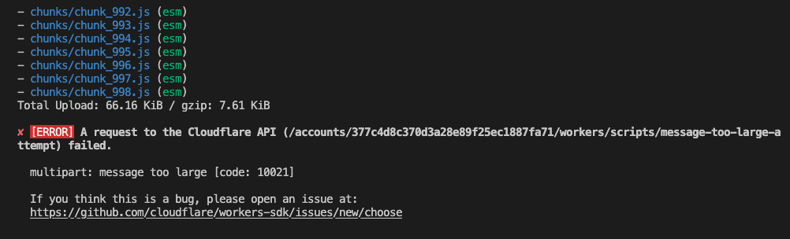

# Reproduction of the "message too large" error

This is a minimal reproduction for the following Workers deployment error:
```
deploy_worker_failed:multipart: message too large
```

It seems like the issue is caused by a large number of modules included in the deployment (through experimentation it seems like the maximum number of supported files is 1000)

## How to reproduce the issue

Simply deploy this worker using wrangler via:
```
$ npm run deploy
```

The deployment should fail because of the message too long error:


If you want to experiment with the number of files you can re-generate the `src` directory
via the `generateSrc.mjs` node script, via:
```
node ./generateSrc.mjs --files=N
```
where `N - 1` is the number of chunk files you want to generate (+ the index.js file)
